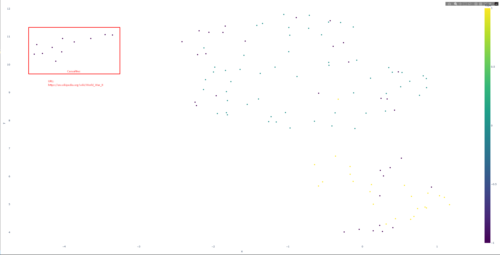

# bert-scraper
 


Scrape website content and extract topics
- Visualize topic distributions
- View extracted topic definitions

#### Usage
```
pipenv shell
pipenv install
python index.py https://mycoolsite.com
```